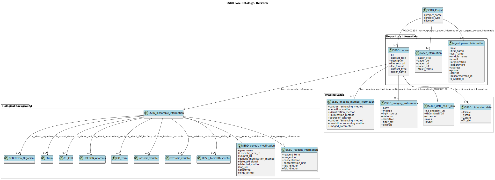

# SSBD Ontology (v2025‑05)

SSBD Ontology: A Two Tier Approach for Interoperable Bioimaging Metadata  
**Repository Layer** (rapid deposition) & **Added‑Value Layer** (curated rich annotations)

　Bioimaging data produced by modern microscopy are expanding at an unprecedented pace, yet their scientific value is often constrained by fragmented metadata. We present the SSBD Ontology, a two-layer semantic model that reconciles rapid publication with ontology-aligned curation. A lightweight repository layer captures only the indispensable descriptors required for DOI assignment, while an added-value layer enriches the same instances with biological context—organism, strain, cell type, anatomy and GO terms—as well as imaging-method and instrument semantics.

The ontology bridges the instance-centric nature of imaging repositories and the class-centric structure of existing OBO ontologies, enabling seamless integration into knowledge graphs. A single SPARQL query retrieves, across modalities, all datasets of C57BL/6J mouse brain recorded by AMATERAS light microscopy and FIB-SEM electron microscopy, returning direct OME-Zarr and Vizarr links in sub-second time.

SSBD Ontology (OWL DL), exemplar instances and conversion scripts are released under CC-BY 4.0 on GitHub and will be mirrored on BioPortal, strengthening the FAIR data ecosystem for bioimaging research.

---

## 1. Ontology 

| Item | URL / File |
|------|------------|
| Integrated ontology (OWL/RDF/XML) | [`ontology/ssbd_integrated.owl`](ontology/ssbd_integrated.owl) |
| Core ontology (OWL/RDF‑XML) | [`ontology/ssbd_core.owl`](ontology/ssbd_core.owl) |
| All individuals (TTL) | [`instance/ssbd_biosample.ttl](instance/ssbd_biosample.ttl) |


### 1.1 Core layer:Seven key entity types



| Layer | Entity class | Typical properties | Linked external vocab |
|-------|--------------|--------------------|-----------------------|
| **Core** | `SSBD_Project` | `has_project_name`, `RO:0002234` (→ Dataset) | — |
| **Core** | `SSBD_dataset` | `has_biosample_information`, `RO:0002180` (→ NGFF) | — |
| **Added** | `SSBD_OME_NGFF_info` | `has_s3_endpoint`, `has_vizarr_url`, sizes | — |
| **Added** | `SSBD_biosample_information` | `is_about_organism/strain/cell/anatomy/GO*` | NCBITaxon, CL, UBERON, GO |
| **Added** | `SSBD_imaging_method_information` | `is_about_imaging_method` | FBbi | 
| **Added** | `SSBD_imaging_instruments` | `has_component` (objective, detector …) |  —  |
| **Added** | `SSBD_dimension_data` | x/y/z/t scale + unit | IAO / UO |

Seven core entities—Project, Dataset, Biosample, Imaging-Method, Instrument, Dimension and OME-NGFF metadata—form a two-tier model. The repository tier (yellow) ensures instant DOI-based release; the added-value tier (pink) delivers deep, ontology-aligned curation while re-using external OBO vocabularies.

### 1.2 Example instance relationships (Project 199 – AMATERAS brain‑slice)


*Project → Dataset → Biosample → OME‑Zarr* relations 
Project 199 (Ichimura): A single Dataset, its Biosample and the associated OME-Zarr metadata are connected via RO relations; external strain and organism terms are linked for immediate cross-repository interoperability.

### 1.3 Sample SPARQL query  
```
PREFIX ssbdont: <http://ssbd.riken.jp/ontology/>
PREFIX obo:     <http://purl.obolibrary.org/obo/>
PREFIX rdfs:    <http://www.w3.org/2000/01/rdf-schema#>

SELECT ?dataset ?title ?methodIRI ?label ?zarr ?vizarr
WHERE {
  ?bs ssbdont:is_about_strain <https://www.jax.org/strain/000664> .

  ?dataset ssbdont:has_biosample_information ?bs ;
           ssbdont:has_dataset_title         ?title ;
           obo:RO_0002180                    ?ngff ;
           ssbdont:has_imaging_method        ?mNode .

  ?mNode ssbdont:is_about_imaging_method ?methodIRI .
  OPTIONAL { ?methodIRI rdfs:label ?label }

  OPTIONAL { ?ngff ssbdont:has_s3_endpoint ?zarr }
  OPTIONAL { ?ngff ssbdont:has_vizarr_url  ?vizarr }
}
ORDER BY ?methodIRI ?dataset
```
 

A single query retrieves all strain C57BL/6J datasets, together with the imaging-method sub-hierarchical tree, OME-Zarr URLs, and Vizarr viewer.
